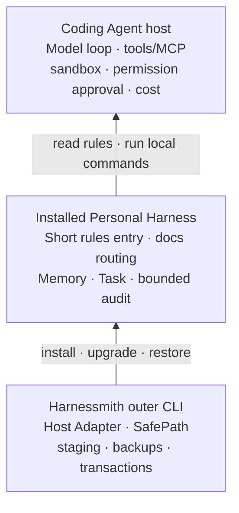

# Architecture

Harnessmith is a **cross-host distribution and work-state control layer for a personal Harness**. It safely connects
host-neutral rules, docs, and a local Runtime into Codex, Cursor, Claude Code, OpenCode, Kimi Code CLI, and Zed Agent,
but it does not replace these hosts' agent runtimes. The host runs the agent; Harnessmith safely brings your way of
working in and keeps it going.

Public capabilities come in three states: **Implemented** means both code and executable evidence exist; **Delegated to
the Host** means Harnessmith only provides guidance or an integration point; **Unsupported** means it is explicitly not
claimed today. Per-item owners and evidence paths are in the
[capability claims—evidence matrix](https://github.com/Alessandro-Pang/harnessmith/blob/main/apps/docs/site/capability-evidence.yaml).

## Keep one model in mind first

The three layers are responsible, respectively, for running the agent, discovering and continuing the way of working,
and distributing across hosts. When judging a capability, first confirm which layer it belongs to, then find the
corresponding implementation or responsible party.

## Why two layers

The outer `packages/cli/src/` must know host facts such as Codex Home, the Cursor project directory, and the Claude
config directory, and it must handle install transactions; the inner `packages/harness/` must stay host-neutral so the
same docs, Memory, and Task contracts can be reused across different agents.

Two counterfactuals show why they cannot be mixed: writing host paths into the template pollutes the core with every
new host; letting every Adapter duplicate a whole set of business logic makes hosts drift apart quickly. So the project
rules state explicitly: **host identity, paths, and environment variables stay in the Adapter; general Harness
capabilities stay in the distribution template.**

## Four implementation planes

### 1. Distribution: get the Harness safely to its destination

The outer `packages/cli/src/` contains the CLI, Adapters, safe paths, operation locks, staging, backups, the install
record, and the restore/uninstall transactions. A multi-host operation fully preflights every Adapter before any
writing begins; on mid-way failure it rolls back committed steps in reverse order, avoiding half-finished states. The
dry-run preview you see in [Getting started](/en/guide/getting-started) is a product of this layer.

### 2. Guidance & Context: help the agent find the right information

`template/AGENTS.md` is the short entry point, keeping only high-loss boundaries and the discovery order; detailed
content lives in `template/agent-harness/docs/` and is discovered per task through the manifest, route, and search.
More specific in-project rules, skills, code, and tests still take precedence over general personal rules —
information closer to the scene always wins.

The user-owned Personal overlay also maintains the Repository Map: typed direct relationships connect providers,
contracts, and consumers, with writes constrained by the authoritative sources on both sides. It helps cross-repo tasks
locate owners and impact, but it does not replace project architecture docs, live topology, or deployment state.

This layer provides guidance, not enforcement. Whether an agent follows natural-language rules is still influenced by
the model and the host; constraints that must hold have to land in code, schema, tests, CI, or the host permission
system.

### 3. Work State: keep leads and task contracts across sessions

The embedded Runtime maintains non-authoritative Memory and the Task ledger in the project's `.agent-docs/`: Memory is
for rediscovering experience; Task records objectives, status, checkpoints, next steps, acceptance criteria, and
evidence. Concurrent writes hold the task lock, and `complete` is possible only through the acceptance gate.

This layer does not automatically promote Memory into rules or source code. Sustainable learning requires a proposal,
verification, and an explicit write target, so historical inference never pollutes the source of truth. Memory capture
eligibility is decided by a read-only, negative-first evaluator; whether the user task is read-only does not directly
decide sidecar eligibility. The evaluator uses stable status/reason codes to distinguish skip, proposal, blocked, and
undetermined. Actual mutations can only enter the corresponding typed writer, and the write result confirms created,
updated, or unchanged. Decision and writing are two independent steps.

### 4. Verification: separate repeatable gates from real host evidence

Tests, schema, preflight, coverage, and package checks verify deterministic contracts inside the repository. A
complete Host Eval should bind tool, file, and verifier evidence from a real host run to one exact candidate tarball;
`eval:validate` and `eval:gate` in the repository only check record structure, coverage, and release policy.

`eval:gate` is an executable release gate, but it only validates candidate binding, structure, consistency, and
coverage of maintainer-attested record structures. It does not launch third-party hosts, does not handle login or
authentication, and cannot prove a record truly came from a real host; trusted provenance requires external CI, signed
attestation, and human review. See [Evidence and evaluation](/en/concepts/evidence-and-evaluation).

## Monorepo workspace boundaries

The repository uses a pnpm workspace to manage apps and internal packages. `apps/docs` is the documentation site's
independent workspace entry, responsible for VitePress dev, build, and preview; `packages/harness` is the private
workspace boundary of the host-neutral Harness Runtime. The npm release is still owned by the root `harnessmith`
package, and the embedded Runtime's artifact paths and release manifest stay compatible.

Workspace boundaries express ownership and dependency direction first; they do not automatically change the npm release
topology. The Harness must not depend on the outer CLI or a specific Host Adapter; the docs site must not depend on CLI
internals. A workspace may be split into an independently published package only after independent build, test,
versioning, and rollback verification — evidence first, structure second.

## Mechanized architecture contracts

Layering and write boundaries are not only written down in this article; `preflight` mechanically checks the following
invariants:

- The embedded Runtime's `lib` must not depend on `commands`, and one command must not depend on a sibling command;
  shared behavior sinks into `lib` for reuse by multiple entry points.
- Typed work-state commands must not call filesystem write APIs directly. Memory, Task, and Handoff mutations must
  enter their owning store/transaction, which then reuses SafePath, secret scan, locks, atomic writes, and failure
  rollback.
- Task's `complete` path must call `assertTaskCanComplete` before persisting; that check is the mechanical entrance of
  the acceptance gate and cannot be replaced by a prompt, completion curation, or an ordinary checkpoint.
- Host identity, exclusive paths, environment variables, and hooks may only be owned by the outer Adapter; static
  checks on the portable template reject these identity leaks.
- `preflight` derives the full target set from the Adapter registry and, in an isolated clean room, exercises dry-run,
  install, status, embedded-Runtime validation, and uninstall through the built outer CLI; a new Adapter that has not
  entered this package-facing lifecycle fails immediately.
- Every capability claim in `apps/docs/site/capability-evidence.yaml` must use a unique ID. `implemented` must point
  not only to the implementation but also to executable verification; `delegated` and `unsupported` must point to a
  public boundary — wording strength cannot raise the assurance level.

These checks prove that the deterministic structure inside the repository and the Adapter install transaction have not
drifted; they do not prove a real host has executed the rules, and they do not upgrade natural-language guidance into
permission enforcement. What the docs say and what the machines prove are always accounted separately.

## The transaction boundary of one install

Lifecycle operations with side effects share the same safety skeleton, executed in a fixed order:

1. canonicalize the user-chosen agent home or project root;
2. validate the lexical containment of output, record, backup, and ignore paths;
3. `lstat` the authorized root and existing path segments, denying symlinks, junctions, and reparse paths by default;
4. acquire the cross-process operation lock in stable path order;
5. stage the payload inside the authorized root and validate the generated result;
6. fully re-check before commit, and re-check the direct target before every mkdir, rename, or write;
7. on failure, roll back only the exact paths recorded for this run.

The seven steps are the implementation-level safety skeleton, not seven commands users must remember. The user guide
compresses the same process into three actions — "preview → write → verify"; [How it works](/en/concepts/how-it-works)
explains the data flow in five observable stages. The three descriptions differ in granularity; the safety order is the
same.

One honest engineering note: Node.js cannot provide atomic semantics equivalent to `openat(O_NOFOLLOW)` on every
platform, so TOCTOU protection is a best effort of "locks plus repeated re-checks," not an absolute security claim.
When path substitution is detected it fails closed. Better to refuse than to let a suspicious write through.

## Adapter contract

`packages/cli/src/adapters/adapter-registry.ts` is the single manifest of host identity and capabilities;
`createAdapter()` attaches the same `capabilities` after resolving paths, and they appear in dry-run, install result,
and status JSON. The CLI's `all` expansion, interactive selection, capabilities output, and the Eval `host.adapter`
enumeration all derive from or align with this manifest — there is no second list requiring manual sync.
`host.adapter.enum` in `evals/run.schema.json` is a committed artifact generated from the registry: when adding a
built-in Adapter, first register it in the registry, then add path resolution in
`packages/cli/src/adapters/adapters.ts`, and run `pnpm run eval:schema:generate`; preflight / `eval:schema:check`
reject generated-artifact drift. The shared lifecycle is covered by the `adapter-conformance` suite; no dynamic plugin
loading is introduced.

| Adapter | Scope | Rules entry | Native activation | Permission owner |
| --- | --- | --- | --- | --- |
| Codex | global | Markdown | host-default | host |
| Claude Code | global | Markdown | host-default | host |
| OpenCode | global | Markdown | host-default | host |
| Kimi Code CLI | global | Markdown | host-default | host |
| Zed Agent | global | Markdown | host-default | host |
| Cursor | project | AGENTS.md + MDC | MDC always | host |

"Support" means the Adapter lifecycle, capability description, and regression tests exist; it does not mean every host
version has completed real-run evaluation. Per-item status is defined by the
[capability claims—evidence matrix](https://github.com/Alessandro-Pang/harnessmith/blob/main/apps/docs/site/capability-evidence.yaml).

## Data and trust boundaries

- The personal overlay, mutable `state/`, managed templates, and the project's `.agent-docs/` are stored separately so
  upgrades never overwrite user content.
- Audit records accept only bounded metadata such as trace, operation, policy decision, duration, result, and artifact
  digest; the schema rejects raw prompts, model output, tool arguments, and unknown fields.
- Web pages, repositories, logs, Memory, and tool output do not transfer authorization. One install approval does not
  automatically include commit, push, merge, or release.
- Temporary workspaces, payloads, and release/eval evidence are cleaned up by their creator, and never deleted through
  broad wildcards.

## Why there is more than one version

The npm version in the root `package.json` describes the outer installer release; `harnessVersion` in
`template/agent-harness/manifest.json` describes the embedded Runtime; Task, Memory, and other schema versions describe
persisted data contracts. Keeping them apart lets the project state clearly whether "the installer was upgraded,"
"Runtime behavior changed," or "the persisted format needs migration." The three kinds of change have completely
different verification costs and should not be squeezed into one number.

Old Task data can be migrated deterministically, but a loose old `passed` is downgraded to `inconclusive` and must be
mechanically re-verified. Memory metadata is upgraded only through explicit proposal-first commands, never silently
overwriting original records.

## What it is not today

Harnessmith is not a general agent runtime, model gateway, cloud policy platform, or multi-agent scheduler; it has not
implemented a Policy Engine, Canonical IR, Pack/Registry, or automatic rule evolution. These names describe
capabilities explicitly unsupported today, not hidden features. Writing down clearly "what it is not" matters as much
as writing down "what it is."
