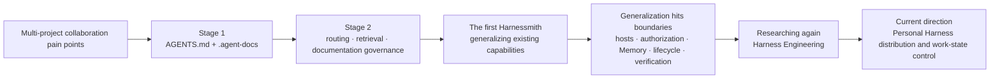
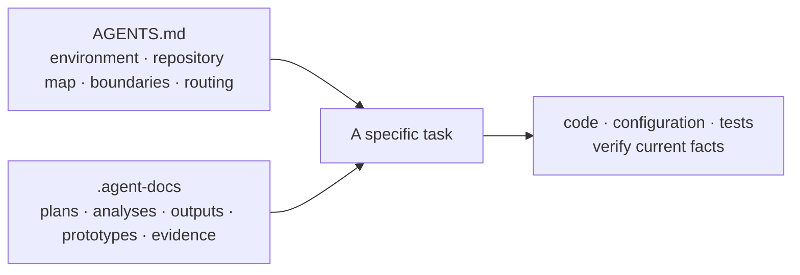

# History and influences

Harnessmith was not designed from a pre-existing theory of Harness Engineering. It started as a solution to a very
practical problem: I kept switching between multiple projects and wanted to turn the `AGENTS.md` rules, docs
retrieval, and work records that had already proven effective into a reusable set of tools that different projects
and different coding agents could use directly.

But once generalization actually began, the problem quickly outgrew "distributing a few files": how to adapt to
different hosts, how to constrain operation permissions, how to manage Memory, how to wrap up installation and
upgrades, and how to verify results. While solving these problems, I realized Harnessmith was heading toward what
the industry calls Harness Engineering. That is also why the project later began systematically researching this
field and, based on that research, reorganized its own positioning and boundaries.

This page records that path in chronological order: first workspace practice, then documentation governance, then
generalization, and only last domain research. It explains "why we arrived here"; it does not define "what is
currently implemented". The latter question is answered by code, tests, and official documentation.

## Stage 1: AGENTS.md and .agent-docs

The story starts with a very concrete pain point: a single requirement often spans several related repositories, and
every time you switch projects or start a new session, you have to re-explain the project relationships, business
background, current progress, and development constraints. Repeating this background over and over is the biggest
waste of context in daily work. Stage 1 had no goal of building a general Harness yet; it simply maintained an
`AGENTS.md` at the workspace root and used `.agent-docs` to store the work documents continuously produced during
tasks.

### AGENTS.md: first establish a workspace map

The early `AGENTS.md` was not just a code style checklist; it was a workspace map for the agent. It explained in one
place:

- the current runtime environment and its limits, for example whether the workspace root is a Git repository, how
  services start, and which system capabilities cannot be assumed to exist;
- each subproject's location, responsibilities, tech stack, package manager, common ports, and local agent entry
  point;
- dependencies, migrations, and protocol relationships between projects, and the owner of each capability;
- common commands for each project, and the Git, build, and package-management operations that must not run in the
  wrong directory;
- which local rules to keep reading after entering a specific project, with the more specific rules taking
  precedence.

Its value is letting the agent first answer "where am I, which repository should I enter, who owns this capability,
and which toolchain must I follow" before it starts reading code. That both reduces repeated explanations of the
background and lowers the risk of editing the wrong repository, mixing commands, or mistaking adjacent systems for
the same module.

### .agent-docs: keeping work context outside the conversation

`.agent-docs` used per-task directories to store plans, analyses, outputs, prototypes, and evidence. Early material
already recorded background, objectives, non-goals, scope, risks, stages, and acceptance, broke options into
executable tasks, and preserved review scope, code evidence, rejected options, archive status, and follow-up
conclusions. Compared with leaving only the final commit, these documents could also explain "why it was done this
way", "which paths had already been verified", and "what scope the current conclusion applies to".

This brought several direct benefits:

- long-running tasks can resume across sessions without relying on one conversation to keep all context;
- options, tasks, and verification evidence can live in the same topic directory, making it easier to continue and
  review;
- prototypes, design assets, and analysis results can be stored alongside the written explanation, reducing
  re-collection;
- cross-repository investigations can preserve relationships and boundaries while still requiring a return to the
  specific repository to check the implementation.

The core of this structure: the entry point handles navigation, and work documents carry context. It forms a plain
working path: first locate the project and rules the task belongs to, then restore context, and finally go back to
code, configuration, and tests to verify current facts.

Stage 1 also had clear limits: no unified index, inconsistent metadata and status expressions, work conclusions
mixed together with raw outputs, images, and prototypes, and whether content was still valid depended mostly on
human judgment. It was good at preserving context, but it was not yet a Memory system that is searchable,
verifiable, and clearly separates current facts from historical leads.

## Stage 2: making documents routable, searchable, and governable

As files multiplied, "writing things down" was no longer the hardest problem. Historical documents record how
decisions formed, how options evolved, and why old conclusions were superseded; they cannot simply be deleted to
control size. But if the agent reads every document in sequence every time, more and more stale and weakly relevant
information keeps crowding out the model context, diluting current facts, and even letting conflicting old
conclusions raise the risk of misjudgment and hallucination.

So the problem Stage 2 had to solve was not "how to keep fewer documents" but "how to keep history while sending
only what the current task truly needs into the context". The hand-made directories of Stage 1 were thereby
organized into a documentation and memory system that is routable, searchable, and able to distinguish status and
source.

### From walking directories to progressive retrieval

`AGENTS.md` no longer asks the agent to read the entire `docs/` or `.agent-docs/` in sequence; instead, the search
CLI becomes the starting point of a task:

1. first query metadata such as title, description, type, tags, scope, and time to narrow the candidate documents;
2. query body paragraphs only when needed, with results carrying the heading path, line numbers, document date, and
   metadata;
3. read the full file only when a candidate is genuinely relevant;
4. restrict to official documents or agent work documents, and filter by recent updates, calendar day, or date
   range;
5. a standalone check mode validates required metadata, keeping documents with unknown status or ownership out of
   the retrieval set.

This is progressive retrieval: discover first, expand locally next, and read the full body only at the end. History
is still fully preserved but does not enter every conversation by default; only content that is relevant to the
current task, with status and source worth further checking, occupies model context. This controls context costs,
reduces the chances of old conclusions interfering with current judgment, and makes "why this document was read"
explainable.

### Separating rules, facts, and memory

Stage 2 explicitly separated three kinds of content that used to be mixed together:

| Layer | Question it answers | Main contents |
| --- | --- | --- |
| Rules layer | How the agent should work | `AGENTS.md`, Skills, retrieval and check scripts |
| Facts layer | What the project actually is right now | Official documentation, code, configuration, tests, and schemas |
| Memory layer | What this work has been through | Inputs, handoffs, stage work, evidence, and expensive findings in `.agent-docs` |

`.agent-docs` is explicitly marked as non-authoritative memory. Even if a conclusion in it was once correct, it must
be re-checked when it conflicts with current code or official documentation; being easier to find in search never
makes it a source of truth.

### Adding types and lifecycles to .agent-docs

The early practice of creating a directory per task converged into the `README.md + core.md` entry structure.
`core.md` indexes only currently active topics and high-value entry points without copying project facts; bodies are
divided by purpose into `input`, `episode`, `working`, `distilled`, and `evidence`:

- `input` keeps the user's original input, links, and acceptance requirements;
- `episode` records session objectives, actions, verification, unfinished items, and handoffs;
- `working` stores options, investigations, reviews, and plans that can still change;
- `distilled` distills experience that remains valuable across tasks and is expensive to rediscover;
- `evidence` stores sanitized tests, logs, screenshots, or benchmark manifests.

Each memory entry uses metadata to describe `status`, time, tags, scope, and `source-refs`, and explicitly declares
`source-of-truth: false`. Stable conclusions must be promoted into official documentation, code, tests, or schemas;
multiple sessions can be compressed into distilled records; completed or superseded content enters the archive while
keeping its traceability relationships. Memory began to have sources, states, and exit mechanisms instead of being
just an ever-growing folder.

### What concretely improved over Stage 1

| Stage 1 problem | Stage 2 improvement |
| --- | --- |
| Not knowing which file to read | Query metadata and matched paragraphs first, then read the full body |
| Manual digging once directories grew | Filtering by source, keyword, time, and recent updates |
| Work records easily confused with current facts | Explicit rules, facts, and non-authoritative memory layers |
| Inconsistent status expressions across documents | Unified types, status, scope, and source refs |
| Finished tasks kept occupying search results | Distill high-value findings; archive completed or expired content |
| Missing fields discovered only after reading | The search CLI also performs metadata checks |

Stage 2 had solved the rules entry point, document discovery, and Memory governance within a single project, but it
still depended on project-specific `AGENTS.md` files, directory structures, and search scripts. Moving to a new
project or coding agent still required copying, adjusting, and maintaining these capabilities by hand.

What is described here is the early project-specific tooling, not documentation for the current Harness Runtime
commands. Generalization kept the progressive discovery approach but did not preserve the original tools' command
surface one-to-one: today `route` / `explain` select rules first, the general `search` performs bounded body
retrieval, and `memory list`, `memory check`, and `memory maintain` handle Memory metadata discovery, integrity
checks, and lifecycle candidates respectively. Source and date filtering of official `docs` is not part of the
current contract; current parameters and budgets are always defined by the [Runtime CLI](/en/reference/runtime-cli).

## Harnessmith originally just wanted to generalize Stage 2

Harnessmith originally only wanted to generalize Stage 2: extract the already-proven short rules entry point, docs
routing, search CLI, `.agent-docs` structure, and maintenance conventions out of a single project and turn them into
a general capability that is not bound to any specific business and can be installed into different projects and
coding agents.

The initial goal was not to implement an industry-defined Harness, nor to plan features around some Harness layering
model first. The earliest judgment was simpler: if these rules, retrieval, and Memory methods no longer had to be
copied by hand into every project and could stay consistent across different agents, the main problem was already
solved.

This goal looked like a one-time "template extraction", but once generalization actually began, the problem quickly
changed.

## Why generalization pushed the problem toward Harness

Project rules coupled to one business only need to work in familiar repositories and environments; a general
capability must face hosts and user sites that cannot be assumed in advance. The genuinely hard part gradually
shifted from copying documents to host differences, authorization boundaries, Memory, lifecycle, and verification.

| Problem met during generalization | Simple approach that could no longer be used | Resulting design |
| --- | --- | --- |
| Different coding agents use different rule paths, formats, and activation methods | Copying the same file to a fixed directory | Host Adapters layered over host-neutral templates |
| Target locations may already contain user files or old versions | Overwriting directly | Ownership checks, dry run, backups, restore, and rollback |
| Markdown can state requirements but cannot grant permissions | Writing the rules more forcefully | Separating guidance from enforcement; permissions stay with the host and the user |
| Historical records can go stale or conflict with each other | Treating search hits as facts | Non-authoritative Memory, source pointers, conflict checking, and explicit promotion |
| Session handoffs can only say "how far the work got" | Ending a task on seeing a completion description | Task, acceptance, evidence, and a completion gate |
| Repository tests cannot prove real agent-host behavior | Claiming support after running only unit tests | Separating deterministic gates, Host Eval, and manual review |

These problems had outgrown the scope of a "general documentation tool": they began to involve how context enters
the agent, how state persists across sessions, how changes land safely, how results are verified, and which
capabilities must be left to the host. Harnessmith therefore gradually formed its two-layer structure: the outer CLI
handles cross-host distribution and a safe lifecycle, while the inner Personal Harness handles rule routing, docs
retrieval, non-authoritative Memory, Task, and limited audit.

## Only later did we research Harness Engineering again

By this point the project realized these problems overlapped heavily with the Harness Engineering being discussed in
the industry. The actual order was: encounter engineering problems first, then research the field again — not obtain
a theory first and look for a place to apply it.

During this research, the traditional [test harness](https://en.wikipedia.org/wiki/Test_harness) provided the base
semantics of "fixed input, execution, and result comparison", and
[lm-evaluation-harness](https://github.com/EleutherAI/lm-evaluation-harness) showed what a Harness looks like in
model evaluation scenarios; they help distinguish testing, evaluation infrastructure, and the work layer for coding
agents, and do not directly define Harnessmith's features.

[Anthropic: Effective harnesses for long-running agents](https://www.anthropic.com/engineering/effective-harnesses-for-long-running-agents)
discusses incremental work across contexts and handoff artifacts;
[OpenAI Harness Engineering](https://openai.com/index/harness-engineering/) emphasizes repository knowledge, feedback
loops, and mechanical constraints; and the recent survey
[Agent Harness Engineering: A Survey](https://picrew.github.io/LLM-Harness/) organizes the Agent Harness into seven
layers: Execution, Tool, Context, Lifecycle, Observability, Verification, and Governance. They provide terminology
and a fuller set of inspection coordinates for problems that had already appeared: docs routing belongs to Context,
Task and recovery belong to Lifecycle, gates and Host Eval belong to Verification, and authorization and owners
belong to Governance.

What this research changed was the project's understanding of its own boundaries and direction, not a rewrite of its
origin. Harnessmith became more precisely defined, from "generalizing a set of rules, retrieval, and Memory
capabilities" to "a cross-host Personal Harness distribution and work-state control layer", and began systematically
checking what it does and does not do in each Harness layer.

As of the current state of the material, that survey has not yet passed double-blind review, and its corpus and
classification boundaries have clear limits. It is therefore a research map, not an industry standard or a feature
checklist. A map tells you the direction but cannot walk for you. Nor does adopting the Harness Engineering
perspective make Harnessmith claim to implement the model loop, tool scheduling, sandboxing, permission approval, or
multi-agent orchestration; those remain the responsibility of the coding agent host.

## What counts as current facts

History explains "why we arrived here" but does not define "what is concretely implemented today". Current facts
still come from `packages/cli/src/`, `packages/harness/src/`, tests, schemas, manifests, `package.json`, capability
claims, and the corresponding official documentation.

| Understanding formed in history | Where Harnessmith lands today | Explicit boundary |
| --- | --- | --- |
| The entry point should be a map, not an encyclopedia | Short rules entry point, manifest, `route`, `search` | The host decides which guidance is ultimately read and adopted |
| Project relationships need structured maintenance | Personal overlay and Repository Map | External observations only form proposals; relationships are never rewritten automatically |
| Historical leads cannot pass themselves off as facts | Non-authoritative Memory, source refs, and explicit promotion | Rules, source code, and official documentation are never modified automatically |
| Long-running tasks need recoverable state | Task, checkpoints, handoffs | A handoff record does not mean the task is complete |
| Completion requires checkable evidence | Acceptance gate, repository gates, and Host Eval | The gate never replaces semantic review or trusted external attestation |
| General capabilities must be safely distributable | Adapter, SafePath, locks, staging, backups, and rollback | No promise that the host execution environment is absolutely reliable |

When historical practice, external research, and the current implementation conflict, the current code, executable
contracts, and verified evidence win.
