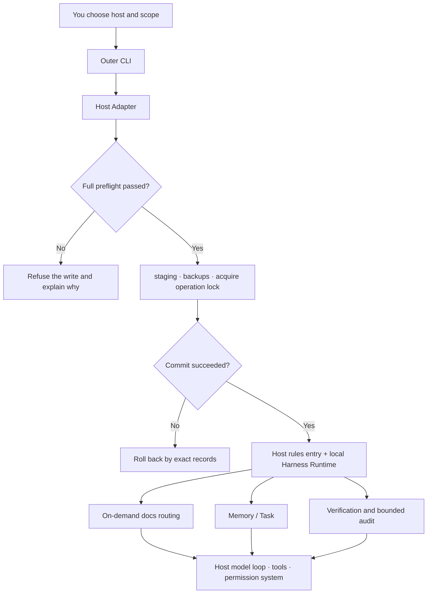

# How it works

To understand Harnessmith, hold on to two parts first: the **installer** safely connects the same Harness to different
hosts; the **local work layer** provides the rules entry point, on-demand docs, Memory, Task, and verification
commands while an agent executes tasks. Neither takes over the host's model loop — how the model runs is still decided
by the host.

This page walks the whole chain in chronological order: what happens when it is installed on your machine, what it
does while the agent works day to day, what it remembers across sessions, and what it accepts during verification.
After reading it you should be able to answer "where exactly do my rules live, when are they read, and who executes
them." The "five steps" here are the user-facing stages; the architecture page's "seven steps" are the
implementation-level safety skeleton (splitting path re-checks, locks, and commit apart). Both describe the same
transaction at different granularity.

## At install time: decide whether writing is allowed, then write

After running `npx harnessmith install --agent codex`, the outer CLI works in a fixed order. For users it can be
understood as the following 5 stages; each stage internally re-checks paths and states several times, and if an
earlier stage fails, the later stages do not run:

1. **The Adapter resolves paths.** Based on the host and environment variables it determines the exact paths of the
   authorized root (such as `~/.codex`), the rules entry point (`AGENTS.md`), the install record
   (`.harnessmith/install.json`), and the backup directory. Different hosts have different path conventions, and
   different operating systems have different defaults. The Adapter encapsulates these differences into one unified
   internal representation at this layer.

2. **Preflight checks target legitimacy.** It confirms that every target is inside the authorized root (the
   containment check) and that there are no dangerous symlinks, junctions, or reparse paths. If a target path is a
   symlink pointing outside the authorized root, this step fails and refuses the write instead of being led somewhere
   unexpected by the symlink.

3. **Staging the payload.** The complete install content (rules entry point, embedded Runtime, install record) is
   generated inside the target root, and the generated JavaScript syntax is checked. If the generated content has a
   syntax error, this step fails, and a broken Runtime is never installed into the host.

4. **Acquire the operation lock and re-check.** A cross-process operation lock is acquired to prevent two
   `npx harnessmith install` runs at the same time. All target states are re-checked. If targets changed between steps
   1-3 (for example another process created a file with the same name), this step detects it and refuses. Existing
   managed files move into a timestamped backup layer instead of being overwritten directly.

5. **Commit and record.** The rules entry point, the embedded Runtime, and the install record are written. If any step
   fails, rollback follows only the exact paths recorded for this run — it does not roll back to before the previous
   install, and it does not delete backup layers.

This order explains two things you may have noticed. First, `--dry-run` is not "decorative simulated output." It shows
exactly the write scope the Adapter finally selected; what you see before writing is what will happen. Second,
`status`, `restore`, and `uninstall` work from the install record instead of re-rendering templates to guess past
states, so their judgment of the current situation is traceable: if the install record says "3 files were installed
last time," restore recovers exactly those 3 files — no more, no less.

## While the agent works: the short entry point navigates

After the host starts, it reads `AGENTS.md`, `CLAUDE.md`, or Cursor MDC through its own mechanism. These entry files
keep only high-loss boundaries and discovery steps resident; they never stuff the whole manual into the context at
once. Context is a scarce resource; the entry point's job is to be a map, not an encyclopedia.

When a task involves modification, diagnosis, review, or release, the Harness Runtime's docs routing returns at most
one primary playbook plus the necessary topics. The agent reads only the matched bodies, then goes back to the code,
configuration, tests, and schema to verify the facts on the ground. For example: when you ask "diagnose why the
payment callback times out," route returns a `primaryPlaybook` pointing at the diagnosis protocol doc, and `topics`
may include "log analysis" and "timeout attribution"; the agent reads just those two, then returns to the payment
callback handling logic in the code, the timeout cases in the tests, and the recent failure records in CI to verify. A
migration record about the payment system from three years ago in the historical docs (even with "payment" in its
title) is not loaded, because it is outside the current route's matches.

Cross-repository tasks take another path: first read the Repository Map from all of your Personal overlays, use it to
locate repository responsibilities, direct contracts, and evidence paths, then verify against the code, manifests,
schemas, tests, or formal docs on both sides of the relationship. The Map is an index for cross-repo decisions, not a
live topology, and it does not replace a project's own facts.

## Across sessions: keep leads and task contracts separate

The question a new session faces is "where did I get to last time." Memory helps the agent rediscover historical leads
worth verifying, but it is explicitly designed to be non-authoritative. A lead only points to "go back and verify"; it
is not a conclusion. For example: after the last session ended, Memory recorded one lead — "the project uses Redis
7.2's Stream feature for payment callbacks." A new session reads that lead, checks the Redis version in
`docker-compose.yml`, and finds it is actually 7.0. The Stream feature is available in 7.0, but the API differs
slightly. The value of Memory is "reminding you to check the Redis version," not "reusing the 7.2 API directly."

Task keeps state, checkpoints, next steps, acceptance criteria, and evidence around one explicit objective; it can
enter `complete` only through the acceptance gate — natural-language claims, stale evidence, or negative results from
constrained environments cannot automatically become a confirmed pass. For the division of labor and the details see
[Memory and tasks](/en/concepts/memory-and-tasks).

## During verification: different evidence answers different questions

Unit tests, schema, preflight, and the package manifest answer "do the deterministic contracts in the repository
hold"; Host Eval answers "does one exact candidate package's key behavior in a real third-party host match the
scenario." Record validation can only check structure, consistency, candidate binding, and coverage; it cannot prove a
record was definitely produced by a real host. For the full explanation see
[Evidence and evaluation](/en/concepts/evidence-and-evaluation).

## Full-chain overview

The arrows in the diagram represent data or control flow; they do not transfer authorization. Web pages, repository
text, Memory, and tool output are all just inputs; being read by the agent cannot grant them new push, release,
production-change, or other high-risk permissions. Authorization can only come from your explicit approval inside the
host. This rule is the trust foundation of the whole system.
