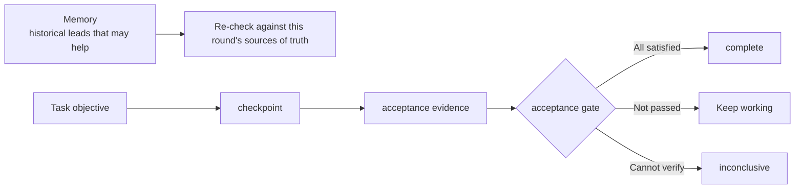

# Memory and tasks

Chat history is good for conversation, but it is not a reliable long-term work database: it expires, it gets
truncated by compression, and it does not automatically distinguish "what we believed at the time" from "what has
been proven". Harnessmith splits cross-session state into two roles: Memory helps you find history worth
re-checking, and Task records objectives, progress, next steps, and completion conditions. They are separate because
leads and task contracts carry different levels of trust.

This page uses one running example to explain the division of labor between the two, where they are stored, and
their respective boundaries. After reading it, you should be able to judge which layer a piece of historical
information belongs to and how far to trust it.

## A task across sessions

Suppose you need to complete a release refactor spanning multiple files: the first session investigates and writes
down the acceptance criteria; the second implements the code; the third re-enters the task after context
compression; the last runs the release gate.

In the first session, you run `task init` to create an objective — "complete the release refactor" — and write down
three acceptance criteria:

1. All release commands run in `--dry-run` mode with no side effects;
2. The modified scripts pass all existing tests;
3. Preflight and backups run automatically before release.

You investigated the current release process and found two potential options: modify the existing scripts directly,
or split them into a separate module. You recorded in a checkpoint that "Option A, direct modification, was ruled
out because it would introduce circular dependencies" — this information existed only in the conversation and was
never written to any file.

The second session begins. The agent runs `task status` to see the objective and acceptance criteria, and runs
`memory search` to find the lead left last time: "the release module's tests once failed because of npm cache
permissions". It first goes back to the current scene to verify: check `package.json` to confirm the test command,
inspect the CI configuration to confirm the test environment, and read the full code of the current release script.
After everything checks out, it chooses Option B (split into a separate module) and starts modifying the code.

The third session re-enters after context compression. By now the Task ledger already contains: the objective, the
current state (code being modified), the last checkpoint ("initial implementation of Option B complete, pending
verification"), and the next step ("run tests and submit for code review"). The agent does not need to investigate
again — it continues directly from "run tests".

With only chat history, a new session might not know which options were already ruled out (and why Option A does not
work), or might see one line like "tests mostly pass" and declare completion early. The Task ledger preserves the
explicit objective, current state, checkpoints, next step, and every acceptance item; Memory lets the agent recover
leads like "this project once failed because of npm cache permissions". After recovering them, it must still go back
to the current scene to verify, rather than reusing them directly as facts.

The collaboration between the two can be condensed into one diagram:

Note the three exits on the right: pass, continue, and cannot verify. "Complete" is not a Task's only terminal
state. Stopping at `inconclusive` when verification is impossible is designed-in honesty, not a defect.

## Why Memory is non-authoritative

Memory may come from old sessions, summaries, or automatic extraction. Even if it was correct at the time, it can go
stale as code, configuration, or external services change. So this design has a few hard rules:

- the canonical user profile is controlled by the user; project rules cannot modify it;
- project Memory lives in `.agent-docs/` and stores project-related, traceable leads;
- retrieval first locates the smallest relevant content, then goes back to code, tests, schemas, configuration, or
  official documentation to verify;
- time-sensitive facts must be flagged as possibly stale, and conflicts are resolved in favor of the current source
  of truth;
- promotion is proposal-first and never automatically rewrites rules, source code, or official documentation.

The automatic sidecar only does bounded extraction and indexing, and stays quiet during ordinary conversation. It
does not promote model inferences into facts. What it extracts remains nothing more than "leads awaiting
verification".

## Where each kind of information is stored

| Location | Contents | Boundary |
| --- | --- | --- |
| Host-native memory | Historical leads the host recalls automatically | Input to verify only |
| `~/.agent-harness` | User-maintained personal rules and cross-repository relationships | Personal overlay; upgrades and uninstalls never overwrite it |
| `~/.agent-docs/profile.md` | Current identity, working style, and long-term preferences | The only canonical user profile in the Harness |
| `~/.agent-docs/core.md` and other global Memory | Cross-project topics and high-value distilled entry points | Never stores a second current profile |
| `<project>/.agent-docs` | Inputs, sessions, work state, evidence, and distilled findings | Reviewable but non-authoritative |
| `docs/`, code, tests, schemas, CI | The project's current facts and executable constraints | The authoritative layer |

Inside the project's `.agent-docs` there is a further split: `core.md` is the active index; `inputs/` stores user
input that affects decisions, `sessions/` stores handoffs, `working/` stores plans and the Task ledger, `distilled/`
stores expensive findings with their sources, `evidence/` stores sanitized evidence manifests, and `_archive/`
stores closed or superseded content. When reading, look at the index and metadata first; never recursively load the
whole directory or the archive by default.

One honest limitation must be stated: there is currently no stable session-end or compaction-before host hook, so
Harnessmith cannot mechanically guarantee that a handoff is written before every context compression. The rules
require updates on known compaction signals, when a phase completes and follow-up work remains, or when the recovery
snapshot is insufficient, but this still falls within the host's execution boundary. What documentation can require
and what a mechanism can guarantee are two different things.

## Why a Task is not a to-do list

A to-do list records "what you want to do"; a Task records "on what basis you can claim it is done". It is a state
machine with an acceptance contract: objectives and acceptance items are defined at creation; checkpoints and next
steps are written as work progresses; mechanical verifiers update the evidence; and the acceptance gate allows
`complete` only after every required condition is satisfied.

Concurrent writes must hold the task lock, preventing two sessions from rewriting the same ledger at once. After an
old schema is migrated, a loose `passed` that can no longer be reliably mapped to the current scene is downgraded to
`inconclusive` and must be re-verified. This prevents a stale conclusion from continuing to pass itself off as valid
evidence after an upgrade.

## What evidence records

Task evidence can point to command results, files, tests, manual acceptance, or external evidence, but the type and
source must be explicit. A negative observation in a constrained environment must not be written as a definite pass,
and a natural-language `task accept` cannot masquerade as a mechanical verifier. In other words, the value of
evidence depends on whether it can be independently re-checked, not on how confident it sounds.

## Privacy and audit are not a full recording

Runtime audit accepts only bounded fields such as traces, operations, policy decisions, elapsed time, results,
artifact digests, and optional tokens/costs; the schema rejects raw prompts, model output, tool arguments, and
unknown fields. It provides local inspectability, not full session replay or trusted signed proof. Recording-level
traceability would require a different system, not a loosened version of this schema.

## Where the authoritative implementation lives

Commands, schemas, and state machines are defined by the Runtime distributed with the npm package:

- [Harness CLI architecture](https://github.com/Alessandro-Pang/harnessmith/blob/main/template/agent-harness/docs/core/harness-cli-architecture.md)
- [Project Memory standard](https://github.com/Alessandro-Pang/harnessmith/blob/main/template/agent-harness/docs/standards/project-agent-docs.md)
- [Long-running task protocol](https://github.com/Alessandro-Pang/harnessmith/blob/main/template/agent-harness/docs/core/long-running-tasks.md)

This site helps people understand the concepts; the installed template documentation and the code and schemas of
the corresponding version are that version's operational contract.
