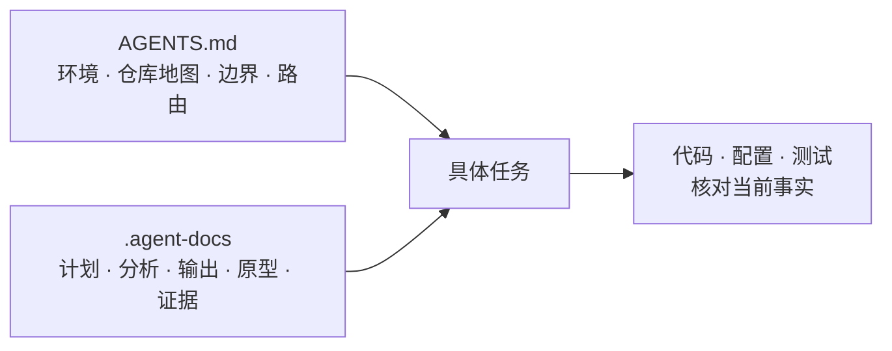

# 历史与思想来源

Harnessmith 不是先有一套 Harness Engineering 理论，再照着它设计出来的。它起初只是为了解决一个很实际的问题：我需要在
多个项目之间反复切换，希望把已经验证有效的 `AGENTS.md`、文档检索和工作记录整理成一套可复用的工具，让不同项目、不同
Coding Agent 都能直接使用。

但真正开始做通用化后，问题很快超出了「把几份文件分发出去」的范围：不同宿主如何适配，操作权限如何约束，Memory 如何
管理，安装和升级如何收尾，结果又该如何验证。解决这些问题的过程中，我才发现 Harnessmith 正在走向业界所说的 Harness
Engineering。也正因如此，项目后来才开始系统调研这一领域，并据此重新梳理自己的定位和边界。

这一页按时间顺序记录这条路径：先有工作区的实践，再有文档治理，然后是通用化，最后才是领域调研。它解释「为什么走到
这里」，不定义「当前实现了什么」。后一个问题由代码、测试和正式文档回答。

## 第一阶段：AGENTS.md 与 .agent-docs

故事开始于一个很具体的痛点：一个需求经常横跨多个关联仓库，每次切换项目或新建会话，都要重新解释项目关系、业务背景、
当前进度和开发约束。重复口述这些背景，是日常里最浪费上下文的一件事。第一阶段还没有构建通用 Harness 的目标，只是在
工作区根目录维护 `AGENTS.md`，同时用 `.agent-docs` 保存任务过程中不断产生的工作文档。

### AGENTS.md：先建立工作区地图

早期的 `AGENTS.md` 不只是代码风格清单，而是一张面向 Agent 的工作区地图。它集中说明：

- 当前运行环境及其限制，例如工作区根目录是否是 Git 仓库、服务如何启动、哪些系统能力不能假设存在；
- 各子项目的位置、职责、技术栈、包管理器、常用端口和局部 Agent 入口；
- 项目之间的依赖、迁移和协议关系，以及各项能力的 owner；
- 每个项目的常用命令，以及不能在错误目录执行的 Git、构建和包管理操作；
- 进入具体项目后应该继续读取哪些局部规则，并以更具体的规则为准。

它的价值是让 Agent 先回答“我在哪里、应该进入哪个仓库、谁负责这项能力、要遵守哪套工具链”，再开始阅读代码。这样既减少
反复口述背景，也降低了在错误仓库修改、混用命令或把相邻系统误认为同一模块的风险。

### .agent-docs：把工作上下文留在对话之外

`.agent-docs` 用任务目录保存计划、分析、输出、原型和证据。早期材料已经会记录背景、目标、非目标、范围、风险、阶段和验收，
也会把方案拆成可执行任务，保存评审范围、代码证据、被否决方案、归档状态和后续结论。相比只留下最终 commit，这些文档还能
解释“为什么这样做”“哪些路径已经验证过”“当前结论适用于什么范围”。

这带来了几个直接收益：

- 长任务可以跨会话恢复，不必依赖一次对话保留全部上下文；
- 方案、任务和验证证据可以放在同一主题目录中，便于继续推进和复核；
- 原型、设计素材和分析结果可以与文字说明一起保存，减少重新搜集；
- 跨仓调查可以保留关系和边界，同时仍要求回到具体仓库核对实现。

这套结构的核心是：入口负责导航，工作文档负责承载上下文。它形成了一条朴素的工作路径：先定位任务所属项目与规则，
再恢复上下文，最后回到代码、配置和测试核对当前事实。

第一阶段也有明显局限：没有统一索引，metadata 和状态表达不一致，工作结论、原始输出、图片和原型混在一起，内容是否仍然
有效主要依赖人工判断。它适合保存上下文，却还不是可检索、可验证、明确区分当前事实与历史线索的 Memory 系统。

## 第二阶段：让文档可以被路由、检索和治理

文件增多以后，“写下来”不再是最难的问题。历史文档记录了决策如何形成、方案怎样演进以及旧结论为什么被替代，不能为了
控制规模就简单删除；但如果每次都让 Agent 顺序读取全部文档，越来越多的过期信息和弱相关内容又会持续挤占模型上下文，
稀释当前事实，甚至让彼此冲突的旧结论增加误判和幻觉的风险。

因此，第二阶段要解决的不是“怎样少留文档”，而是“怎样保留历史，又只把当前任务真正需要的内容送进上下文”。第一阶段的
手工目录由此被整理成一套可路由、可检索、能区分状态和来源的文档与记忆系统。

### 从遍历目录到渐进式检索

`AGENTS.md` 不再要求 Agent 顺序读取整个 `docs/` 或 `.agent-docs/`，而是把搜索 CLI 作为任务起点：

1. 先查 title、description、type、tags、scope 和时间等元信息，缩小候选文档；
2. 必要时再查正文段落，结果附带标题路径、行号、文档日期和元信息；
3. 只有候选确实相关时，才读取完整文件；
4. 可以限定正式文档或 Agent 工作文档，并按最近更新、自然日或日期区间过滤；
5. 独立检查模式验证必需 metadata，避免状态和归属不明的文档进入检索集合。

这就是渐进式检索：先发现，再局部展开，最后才读取完整正文。历史仍然完整保留，但不会默认进入每一次对话；只有与当前任务
相关、状态和来源也值得继续核对的内容，才会占用模型上下文。这既控制了上下文成本，也减少了旧结论干扰当前判断的机会，
并让“为什么读取这份文档”变得可以解释。

### 把规则、事实与记忆分开

第二阶段明确拆开三种以前容易混在一起的内容：

| 层级 | 回答的问题 | 主要内容 |
| --- | --- | --- |
| 规则层 | Agent 应该怎样工作 | `AGENTS.md`、Skill、检索和检查脚本 |
| 事实层 | 项目当前实际是什么 | 正式文档、代码、配置、测试与 schema |
| 记忆层 | 这项工作经历过什么 | `.agent-docs` 中的输入、交接、阶段工作、证据和昂贵发现 |

`.agent-docs` 被明确标记为非权威记忆。即使其中的结论曾经正确，与当前代码或正式文档冲突时也必须重新核对，不能因为它更容易
被搜索到就把它当作事实源。

### 给 .agent-docs 增加类型和生命周期

早期随任务建目录的方式被收敛为 `README.md + core.md` 的入口结构。`core.md` 只索引当前活跃主题和高价值入口，不复制项目
事实；正文按照用途分为 `input`、`episode`、`working`、`distilled` 和 `evidence`：

- `input` 保留用户原始输入、链接和验收要求；
- `episode` 记录会话目标、行动、验证、未完成项与交接；
- `working` 保存仍会变化的方案、调查、评审和计划；
- `distilled` 提炼跨任务仍有价值、重新发现成本高的经验；
- `evidence` 保存脱敏后的测试、日志、截图或 benchmark manifest。

每份记忆使用 metadata 描述 `status`、时间、tags、scope 和 `source-refs`，并明确声明 `source-of-truth: false`。
稳定结论要提升到正式文档、代码、测试或 schema；多个 session 可以压缩为 distilled 记录；完成或被替代的内容进入归档并保留
追溯关系。Memory 开始具备来源、状态和退出机制，而不只是一个不断增长的文件夹。

### 相比第一阶段，具体改善了什么

| 第一阶段的问题 | 第二阶段的改进 |
| --- | --- |
| 不知道应该读哪个文件 | 先查元信息和命中段落，再读取完整正文 |
| 目录增长后只能人工翻找 | 支持来源、关键词、时间和最近更新过滤 |
| 工作记录与当前事实容易混淆 | 明确规则层、事实层和非权威记忆层 |
| 不同文档状态表达不一致 | 使用统一类型、status、scope 和 source refs |
| 完成的任务继续占据检索结果 | 提炼高价值发现，完成或过期内容归档 |
| 文档缺字段只能阅读后才发现 | 搜索 CLI 同时承担 metadata 检查 |

第二阶段已经解决了单个项目中的规则入口、文档发现和 Memory 治理，但仍依赖项目自定义的 `AGENTS.md`、目录结构和搜索脚本。
换到新的项目或 Coding Agent 时，这套能力仍要手动复制、调整和维护。

这里描述的是早期项目专用工具，不是当前 Harness Runtime 的命令说明。通用化保留了渐进发现的方法，但没有一比一保留原工具
的命令面：当前由 `route` / `explain` 先选择规则，通用 `search` 执行有界正文检索，`memory list`、`memory check` 和
`memory maintain` 分别负责 Memory 的元信息发现、完整性检查与生命周期候选。正式 `docs` 的 source 与日期过滤不属于当前
契约；当前参数和预算始终以[运行时 CLI](/reference/runtime-cli)为准。

## Harnessmith 最初只想把第二阶段通用化

Harnessmith 最初只想把第二阶段通用化：把已经验证过的短规则入口、文档路由、搜索 CLI、`.agent-docs` 结构和维护约定，
从单个项目中抽出来，变成一套不绑定具体业务、可以安装到不同项目和 Coding Agent 的通用能力。

最初并不是为了实现一套行业定义的 Harness，也没有先按某个 Harness 分层模型规划功能。最早的判断更简单：如果这些规则、
检索和 Memory 方法不再需要每个项目手工复制，并且可以在不同 Agent 中保持一致，就已经解决了最主要的问题。

这个目标看起来像一次“模板抽取”，但真正开始通用化以后，问题很快发生了变化。

## 通用化为什么把问题推向 Harness

一套与业务耦合的项目规则，只需要在熟悉的仓库和环境里工作；一套通用能力则必须面对无法预先假设的宿主和用户现场。
真正困难的部分逐渐从文档复制变成了宿主差异、授权边界、Memory、生命周期和验证。

| 通用化时遇到的问题 | 不能继续沿用的简单做法 | 形成的设计 |
| --- | --- | --- |
| 不同 Coding Agent 的规则路径、格式和激活方式不同 | 把同一文件复制到固定目录 | Host Adapter 与宿主中立模板分层 |
| 目标位置可能已有用户文件或旧版本 | 直接覆盖 | ownership 检查、dry-run、备份、restore 与回滚 |
| Markdown 可以提出要求，却不能授予权限 | 把规则写得更强硬 | guidance 与 enforcement 分离，权限仍归宿主和用户 |
| 历史记录可能过期或彼此冲突 | 把搜索命中当作事实 | 非权威 Memory、来源指针、冲突核对和显式提升 |
| 会话交接只能说明“做到哪里” | 看到完成描述就结束任务 | Task、acceptance、evidence 和 completion gate |
| 仓库测试不能证明真实 Agent Host 行为 | 只跑单测就声称支持 | 确定性门禁、Host Eval 与人工复核分开 |

这些问题已经超出“通用文档工具”的范围：它们开始涉及上下文怎样进入 Agent、状态怎样跨会话延续、变更怎样安全落地、结果怎样
被验证，以及哪些能力必须留给宿主。Harnessmith 因此逐渐形成两层结构：外层 CLI 负责跨宿主分发和安全生命周期，内层
Personal Harness 负责规则路由、文档检索、非权威 Memory、Task 和有限审计。

## 后来才重新调研 Harness Engineering

到这一步，项目才发现这些问题与业界讨论的 Harness Engineering 高度重合。实际顺序是先遇到工程问题，再重新调研领域，
而不是先拿到一套理论再寻找落地场景。

重新调研时，传统 [test harness](https://en.wikipedia.org/wiki/Test_harness) 提供了“固定输入、执行与结果比较”的基础语义，
[lm-evaluation-harness](https://github.com/EleutherAI/lm-evaluation-harness) 展示了模型评测场景中的 Harness；它们帮助区分测试、
评测基础设施和面向 Coding Agent 的工作层，并不直接定义 Harnessmith 的功能。

[Anthropic: Effective harnesses for long-running agents](https://www.anthropic.com/engineering/effective-harnesses-for-long-running-agents)
讨论跨上下文增量工作与交接 artifact；[OpenAI Harness Engineering](https://openai.com/index/harness-engineering/) 强调仓库知识、
反馈回路和机械约束；近期综述 [Agent Harness Engineering: A Survey](https://picrew.github.io/LLM-Harness/) 则用 Execution、Tool、
Context、Lifecycle、Observability、Verification、Governance 七层整理 Agent Harness。它们为已经出现的问题提供了术语和
更完整的检查坐标：文档路由属于 Context，Task 与恢复属于 Lifecycle，门禁与 Host Eval 属于 Verification，授权和 owner
属于 Governance。

这些研究改变的是项目对自身边界和方向的认识，而不是重写项目起源。Harnessmith 从「通用化一套规则、检索和 Memory 能力」
进一步明确为「跨 Host 的 Personal Harness 分发与工作状态控制层」，并开始系统检查自己在 Harness 各层做了什么、没有做什么。

按当前资料状态，该综述尚未经过双盲评审，语料和分类边界也有明确限制。因此它是研究地图，不是行业标准或功能清单。
地图告诉你方向，但不能替你走路。Harnessmith 也不因为采用 Harness Engineering 的视角，就声称实现模型循环、工具调度、
sandbox、权限批准或多 Agent 编排；这些仍由 Coding Agent 宿主负责。

## 什么才是当前事实

历史解释“为什么走到这里”，但不定义“当前具体实现了什么”。当前事实仍来自 `packages/cli/src/`、`packages/harness/src/`、测试、
schema、manifest、`package.json`、能力声明和对应的正式文档。

| 历史中形成的认识 | Harnessmith 当前落点 | 明确边界 |
| --- | --- | --- |
| 入口应该是地图，不是百科全书 | 短规则入口、manifest、`route`、`search` | 宿主决定最终读取和采用哪些 guidance |
| 项目关系需要结构化维护 | Personal overlay 与 Repository Map | 外部观察只形成 proposal，不自动改写关系 |
| 历史线索不能冒充事实 | 非权威 Memory、source refs 与显式 promotion | 不自动修改规则、源码或正式文档 |
| 长任务需要可恢复状态 | Task、checkpoint、handoff | 交接记录不等于任务已经完成 |
| 完成必须有可核对证据 | acceptance gate、仓库门禁与 Host Eval | gate 不代替语义评审或可信外部 attestation |
| 通用能力必须可安全分发 | Adapter、SafePath、锁、staging、备份和回滚 | 不承诺宿主执行环境绝对可靠 |

当历史实践、外部研究和当前实现冲突时，以当前代码、可执行契约和已验证证据为准。
