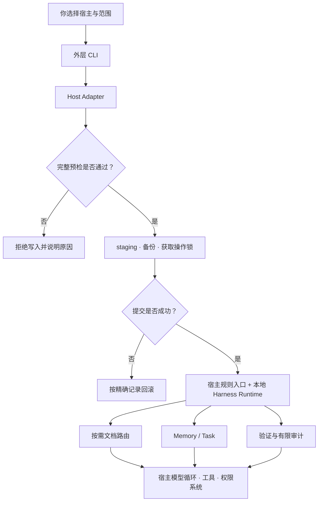

# Harnessmith 如何工作

要理解 Harnessmith，只需要记住一个组合：**安装器 + 本地工作层**。安装器负责把同一份 Harness 安全地接进不同宿主；工作层在 Agent 执行任务时提供规则入口、按需文档、Memory、Task 和验证命令。两者都不接管宿主的模型循环——那是宿主自己的领域。

这一页按时间顺序讲完整条链路：装进机器时发生了什么、Agent 日常工作时它做什么、跨会话时它记什么、验证时它认什么。读完你应该能回答「我的规则到底存在哪、什么时候被读取、谁在执行」。

## 安装时：先决定能不能写，再写

运行 `npx harnessmith install --agent codex` 之后，外层 CLI 按固定顺序工作。这 5 步不是并列的检查项，而是一条有先后依赖的链：前一步失败，后一步不会执行：

1. **Adapter 解析路径。** 根据宿主和环境变量确定授权根（如 `~/.codex`）、规则入口（`AGENTS.md`）、安装记录（`.harnessmith/install.json`）和备份目录的精确路径。不同宿主有不同的路径约定，不同操作系统有不同的默认值。Adapter 在这层把这些差异封装为统一的内部表示。

2. **预检目标合法性。** 确认所有目标都在授权根内（containment 检查），且没有危险的 symlink、junction 或 reparse path。如果目标路径是符号链接指向授权根外部，这一步会失败，拒绝写入，而不是被符号链接引导到预期之外的位置。

3. **Staging payload。** 在目标根内生成完整的安装内容（规则入口、内嵌 Runtime、安装记录），并检查生成的 JavaScript 语法。如果生成的内容有语法错误，这一步会失败，不会把有问题的 Runtime 安装到宿主。

4. **获取操作锁并再次核对。** 获取跨进程操作锁，防止两个 `npx harnessmith install` 同时运行。再次核对所有目标的状态。如果在步骤 1-3 之间目标发生了变化（比如另一个进程创建了同名文件），这一步会检测到并拒绝。已有受管文件进入带时间戳的备份层，不会直接覆盖。

5. **提交并记录。** 写入规则入口、内嵌 Runtime 和安装记录。任一步失败，只按本次记录的精确路径回滚，不会回滚到上一次安装之前，也不会删除备份层。

这个顺序解释了两件你可能已经注意到的事。第一，`--dry-run` 不是「模拟输出的装饰」。它展示的就是 Adapter 最终选择的写入范围，你在写入前看到的就是将要发生的。第二，`status`、`restore` 和 `uninstall` 沿用安装记录工作，而不是靠重新渲染模板去猜测过去的状态，所以它们对现场的判断是可追溯的：如果安装记录说「上次安装了 3 个文件」，restore 就恢复这 3 个文件，不会多也不会少。

## Agent 工作时：短入口负责导航

宿主启动后，会按自己的机制读取 `AGENTS.md`、`CLAUDE.md` 或 Cursor MDC。这些入口文件只常驻高损失边界和发现步骤，不会把整套手册一次性塞进上下文。上下文是稀缺资源，入口的职责是当地图，不是当百科全书。

当任务涉及修改、诊断、评审或发布时，Harness Runtime 的文档路由会返回至多一个主要 playbook 和必要专题。Agent 只读取命中的正文，然后回到代码、配置、测试和 schema 核对现场事实。举个例子：当你请求「诊断支付回调为什么超时」，route 会返回 `primaryPlaybook` 指向诊断协议文档，`topics` 可能包含「日志分析」和「超时归因」；Agent 只读这两篇，读完后回到代码里的支付回调处理逻辑、测试里的超时用例、CI 里的最近失败记录来核对。历史文档里关于支付系统三年前的迁移记录（即使标题里有「支付」二字）不会被加载，因为它不在当前路由的命中范围内。

跨仓库任务另有一条路径：先从你所有的 Personal overlay 读取 Repository Map，用它定位仓库职责、直接契约和证据路径，再到关系两侧的代码、manifest、schema、测试或正式文档复核。Map 是跨仓决策的索引，不是实时拓扑，也不替代项目自身的事实。

## 跨会话时：把线索和任务契约分开

新会话面对的问题是「上次做到哪了」。Memory 帮 Agent 重新找到值得核对的历史线索，但它被明确设计为非权威。线索只指向「回去核对」，不等于结论。举个例子：上次会话结束后，Memory 里记录了一条「项目使用 Redis 7.2 的 Stream 特性处理支付回调」。新会话读到这条线索，去 `docker-compose.yml` 里核对 Redis 版本，发现实际是 7.0。Stream 特性在 7.0 中可用但 API 略有不同。Memory 的价值是「提醒你去核对 Redis 版本」，而不是「直接复用 7.2 的 API」。

Task 围绕一个明确目标保存状态、检查点、下一步、验收条件和证据；只有通过 acceptance gate 才能进入 `complete`，自然语言声称、过期证据或受限环境中的阴性结果都不能自动变成确定通过。两者的分工与细节见[Memory 与 Task](/concepts/memory-and-tasks)。

## 验证时：不同证据回答不同问题

单元测试、schema、preflight 和包清单回答「仓库中的确定性契约是否成立」；Host Eval 回答「某个精确候选包在真实第三方宿主中的关键行为是否符合场景」。记录校验只能核对结构、一致性、候选绑定和覆盖，不能证明记录一定由真实宿主产生。完整解释见[证据与评测](/concepts/evidence-and-evaluation)。

## 全链路示意

图里的箭头表示数据或控制流，不传递授权。网页、仓库文本、Memory 和工具输出都只是输入；它们不能因为被 Agent 读取，就新增 push、发布、生产变更或其他高风险权限。授权只能来自你在宿主里的明确批准。这条规则是整个系统的信任根基。
