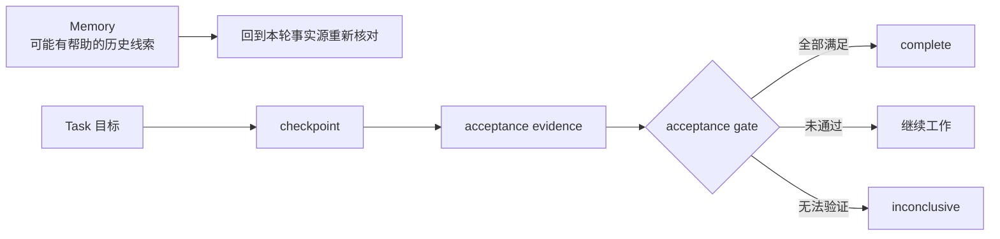

# Memory 与 Task

聊天记录适合交流，却不是可靠的长期工作数据库：它会过期、会被压缩截断、也从不区分「当时以为」和「已经证明」。Harnessmith 把跨会话的持久状态拆成两个角色。Memory 帮你「重新找到值得核对的历史」，Task 回答「这个目标进行到哪里、下一步是什么、凭什么能完成」。两者有意分开，因为线索和契约的可靠程度天然不同。

这一页用一个贯穿的例子讲清两者的分工、存放位置和各自的边界。读完它，你应该能判断一条历史信息该去哪一层、信到什么程度。

## 一个跨会话任务

假设你要完成一次跨多个文件的发布改造：第一轮会话做调查并写下验收条件；第二轮实现代码；第三轮因上下文压缩重新进入任务；最后一轮运行发布门禁。

第一轮会话中，你运行 `task init` 创建了一个目标「完成发布改造」，并写下三条验收条件：

1. 所有发布命令在 `--dry-run` 模式下可运行且无副作用；
2. 修改后的脚本通过全部现有测试；
3. 发布前自动执行预检和备份。

你调查了当前发布流程，发现两个潜在方案：直接在现有脚本上修改，或拆分为独立模块。你在 checkpoint 里记录了「方案 A 直接修改被选排除，因为会引入循环依赖」——这条信息只存在于对话中，没有被写入任何文件。

第二轮会话开始。Agent 运行 `task status` 看到目标和验收条件，运行 `memory search` 找到上次留下的线索「发布模块测试曾因 npm cache 权限失败」。它先回到当前现场验证：查看 `package.json` 确认测试命令、检查 CI 配置确认测试环境、读取当前发布脚本的完整代码。一切核对完毕后，它选择了方案 B（拆分为独立模块），开始修改代码。

第三轮会话因上下文压缩重新进入。此时 Task ledger 里已经有：目标、当前状态（代码修改中）、最后检查点（「已完成方案 B 的初步实现，待验证」）、下一步（「运行测试并提交代码评审」）。Agent 不需要重新调查——直接从「运行测试」继续。

如果只有对话历史，新会话可能不知道哪些方案已经被排除（方案 A 为什么不行），也可能看到一句「测试差不多通过」就提前宣布完成。Task ledger 会保存明确目标、当前状态、检查点、下一步和每条 acceptance；Memory 则让 Agent 找回「这个项目曾因 npm cache 权限失败」之类的线索。找回来之后，仍然要回到当前现场验证，而不是直接当作事实复用。

两者的协作关系可以浓缩成一张图：

注意右侧的三个出口：通过、继续、无法验证。Task 不只有「完成」一个终态。无法验证时停在 `inconclusive`，是设计出来的诚实，不是缺陷。

## Memory 为什么是非权威的

Memory 可能来自旧会话、摘要或自动提取。即使当时正确，也可能随代码、配置或外部服务变化而过期。因此这套设计里有几条硬规则：

- canonical 用户画像由用户控制，项目规则不能修改它；
- 项目 Memory 位于 `.agent-docs/`，保存项目相关且可追溯的线索；
- 检索先定位最小相关内容，再回到代码、测试、schema、配置或正式文档核对；
- 时间敏感事实要标出可能过期，冲突时以当前事实源为准；
- promotion 采用 proposal-first，不自动改写规则、源码或正式文档。

自动 sidecar 只做有界提取和索引，并保持普通对话安静。它不把模型推断升级成事实。提取出来的东西仍然只是「待核对线索」。

## 信息分别保存在哪里

| 位置 | 保存内容 | 边界 |
| --- | --- | --- |
| 宿主原生 memory | 宿主自动召回的历史线索 | 只作待核对输入 |
| `~/.agent-harness` | 用户维护的个人规则与跨仓库关系 | personal overlay；升级和卸载不覆盖 |
| `~/.agent-docs/profile.md` | 当前身份、工作方式与长期偏好 | Harness 内唯一 canonical 用户画像 |
| `~/.agent-docs/core.md` 与其他全局 Memory | 跨项目主题与高价值提炼入口 | 不保存第二份当前画像 |
| `<project>/.agent-docs` | 输入、会话、工作状态、证据与提炼发现 | 可审阅但非权威 |
| `docs/`、代码、测试、schema、CI | 项目当前事实与可执行约束 | 权威层 |

项目 `.agent-docs` 内部再细分：`core.md` 是活跃索引；`inputs/` 保存会影响决策的用户输入，`sessions/` 保存 handoff，`working/` 保存计划与 Task ledger，`distilled/` 保存带来源的昂贵发现，`evidence/` 保存脱敏证据 manifest，`_archive/` 保存已关闭或被替代的内容。读取时先看索引和元信息，不默认递归加载整个目录或 archive。

有一个诚实的限制需要写明：当前没有稳定的 session-end 或 compaction-before 宿主 hook，因此 Harnessmith 不能机械保证每次上下文压缩前都已经写入 handoff。规则会要求在已知压缩信号、阶段完成且仍有后续、或恢复快照不足时更新，但这仍属于宿主执行边界。文档能要求的，和机制能保证的，是两件事。

## Task 为什么不是待办清单

待办清单记录「想做什么」，Task 记录「凭什么说做完了」。它是带验收契约的状态机：创建时定义目标和 acceptance；推进时写入 checkpoint 与下一步；机械 verifier 更新证据；只有所有必需条件满足后，acceptance gate 才允许 `complete`。

并发写入必须持有任务锁，防止两个会话同时改写同一份账本。旧 schema 迁移后，不能可靠对应当前现场的宽松 `passed` 会降为 `inconclusive`，需要重新验证。这能防止一次过期结论在升级后继续冒充有效证据。

## Evidence 记录什么

Task evidence 可以指向命令结果、文件、测试、人工验收或外部证据，但类型和来源必须明确。受限环境中的阴性观察不能写成确定通过；自然语言 `task accept` 也不能伪装成 mechanical verifier。换句话说，证据的价值取决于它能不能被独立复核，而不是它听起来有多肯定。

## 隐私与审计不是完整录像

Runtime audit 只接受 trace、操作、策略决定、耗时、结果、artifact digest 与可选 token/成本等限界字段；schema 拒绝原始 prompt、模型输出、tool arguments 和未知字段。它提供本地可检查性，不提供完整会话回放或可信签名证明。想要录像级别的追溯，需要的是另一套系统，而不是放宽这份 schema。

## 权威实现在哪里

命令、schema 和状态机以随 npm 包分发的 Runtime 为准：

- [Harness CLI architecture](https://github.com/Alessandro-Pang/harnessmith/blob/main/template/agent-harness/docs/core/harness-cli-architecture.md)
- [Project Memory standard](https://github.com/Alessandro-Pang/harnessmith/blob/main/template/agent-harness/docs/standards/project-agent-docs.md)
- [Long-running task protocol](https://github.com/Alessandro-Pang/harnessmith/blob/main/template/agent-harness/docs/core/long-running-tasks.md)

本站帮助人理解概念；安装后的模板文档与对应版本的代码、schema 才是该版本的操作契约。
