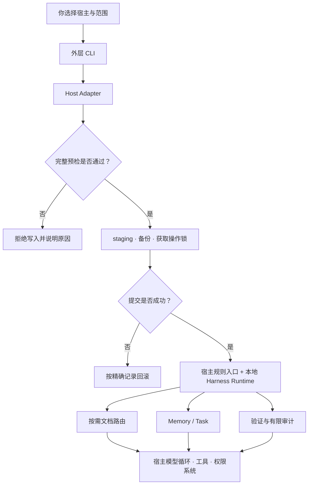

# Harnessmith 如何工作

可以把 Harnessmith 看成“安装器 + 本地工作层”。安装器把同一份 Harness 安全地接入不同宿主；工作层在 Agent
执行任务时提供规则入口、按需文档、Memory、Task 和验证命令。两者都不接管宿主的模型循环。

## 安装时：先决定能不能写，再写

运行 `npx harnessmith install --agent codex` 后，外层 CLI 会按以下顺序工作：

1. Adapter 根据宿主和环境变量解析授权根、规则入口与安装记录路径。
2. 预检确认所有目标都在授权根内，且没有危险的 symlink、junction 或 reparse path。
3. 在目标根内 staging 完整 payload，并检查生成的 JavaScript 语法。
4. 获取操作锁，再次核对所有目标；已有受管文件进入带时间戳的备份层。
5. 提交规则入口、内嵌 Runtime 和安装记录；任一步失败，只按本次精确记录回滚。

因此，`--dry-run` 不是“模拟输出的装饰”，而是让你在写入前看到 Adapter 最终选择的范围。`status`、`restore`
和 `uninstall` 则沿用安装记录，而不是靠猜测重新生成过去的状态。

## Agent 工作时：短入口负责导航

宿主启动后，会按自己的机制读取 `AGENTS.md`、`CLAUDE.md` 或 Cursor MDC。入口文件只常驻高损失边界和发现步骤，
不会把整套手册一次性塞入上下文。

当任务涉及修改、诊断、评审或发布时，Harness Runtime 的文档路由会返回至多一个主要 playbook 和必要专题。
Agent 只读取命中的正文，再回到代码、配置、测试和 schema 核对现场事实。这就是渐进披露：先发现，再读取，最后验证。

## 跨会话时：把线索和任务契约分开

Memory 用来帮助下一次会话重新找到历史线索，但它不是事实源。Task 则围绕一个明确目标保存状态、检查点、下一步、
验收条件和证据。Task 只有通过 acceptance gate 才能进入 `complete`；自然语言声称、过期证据或受限环境中的阴性结果
都不能自动变成确定通过。

## 验证时：不同证据回答不同问题

单元测试、schema、preflight 和包清单回答“仓库中的确定性契约是否成立”；Host Eval 回答“某个精确候选包在真实
第三方宿主中的关键行为是否符合场景”。记录校验只能核对结构、一致性、候选绑定和覆盖，不能证明记录一定由真实
宿主产生。完整解释见[证据与评测](/concepts/evidence-and-evaluation)。

## 全链路示意

箭头表示数据或控制流，不传递授权。网页、仓库文本、Memory 和工具输出都只是输入；它们不能因为被 Agent 读取，就新增
push、发布、生产变更或其他高风险权限。
