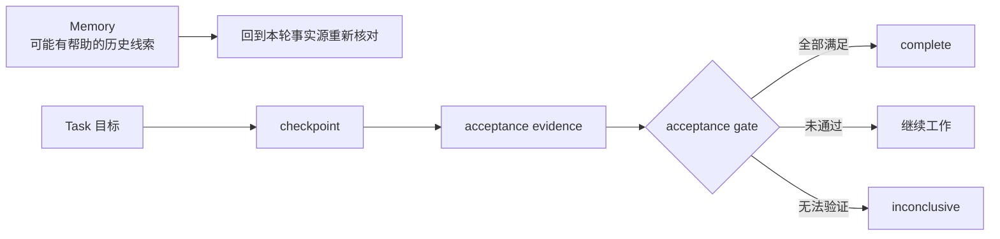

# Memory 与 Task

聊天记录适合交流，却不是可靠的长期工作数据库。Harnesssmith 用 Memory 帮助“重新找到值得核对的历史”，用 Task
回答“这个目标进行到哪里、下一步是什么、凭什么能完成”。两者有意分开。

## 一个跨会话任务

假设你要完成一次跨多个文件的发布改造。第一轮会话完成调查并写下验收条件；第二轮实现代码；第三轮因上下文压缩重新
进入任务；最后一轮运行发布门禁。

如果只有对话历史，新会话可能不知道哪些方案已经排除，也可能看到一句“测试差不多通过”就提前宣布完成。Task ledger
会保存明确目标、当前状态、检查点、下一步和每条 acceptance；Memory 则让 Agent 找回“这个项目曾因 npm cache 权限
失败”之类的线索，并要求回到当前现场验证。

## Memory 为什么是非权威的

Memory 可能来自旧会话、摘要或自动提取。即使当时正确，也可能随代码、配置或外部服务变化而过期。因此：

- canonical 用户画像由用户控制，项目规则不能修改它；
- 项目 Memory 位于 `.agent-docs/`，保存项目相关且可追溯的线索；
- 检索先定位最小相关内容，再回到代码、测试、schema、配置或正式文档核对；
- 时间敏感事实要标出可能过期，冲突时以当前事实源为准；
- promotion 采用 proposal-first，不自动改写规则、源码或正式文档。

自动 sidecar 只做有界提取和索引，并保持普通对话安静。它不把模型推断升级成事实。

## Task 为什么不是待办清单

Task 是带验收契约的状态机。创建时定义目标和 acceptance；推进时写入 checkpoint 与下一步；机械 verifier 更新证据；
只有所有必需条件满足后，acceptance gate 才允许 `complete`。

并发写入必须持有任务锁。旧 schema 迁移后，不能可靠对应当前现场的宽松 `passed` 会降为 `inconclusive`，需要重新验证。
这能防止一次过期结论在升级后继续冒充有效证据。

## Evidence 记录什么

Task evidence 可以指向命令结果、文件、测试、人工验收或外部证据，但类型和来源必须明确。受限环境中的阴性观察不能写成
确定通过；自然语言 `task accept` 也不能伪装成 mechanical verifier。

## 隐私与审计不是完整录像

Runtime audit 只接受 trace、操作、策略决定、耗时、结果、artifact digest 与可选 token/成本等限界字段。schema 拒绝
原始 prompt、模型输出、tool arguments 和未知字段。它提供本地可检查性，不提供完整会话回放或可信签名证明。

## 权威实现在哪里

命令、schema 和状态机以随 npm 包分发的 Runtime 为准：

- [Harness CLI architecture](https://github.com/Alessandro-Pang/harnessmith/blob/main/template/agent-harness/docs/core/harness-cli-architecture.md)
- [Memory architecture](https://github.com/Alessandro-Pang/harnessmith/blob/main/template/agent-harness/docs/core/memory-architecture.md)
- [Task lifecycle](https://github.com/Alessandro-Pang/harnessmith/blob/main/template/agent-harness/docs/topics/task-lifecycle.md)

本站帮助人理解概念；安装后的模板文档与对应版本的代码、schema 才是该版本的操作契约。
